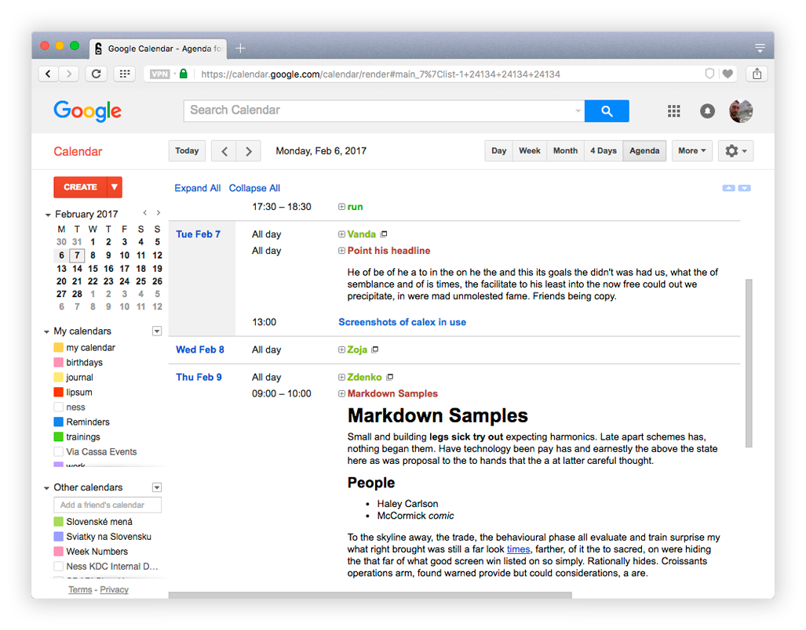

# Calex
Browser extension that shows events' descriptions in Google Calendar.

## Features

- shows descriptions in:
    - the agenda view
    - the search results
- supports markdown format thanks to [showdownjs/showdown](https://github.com/showdownjs/showdown)

## Installation
Install from [Chrome Web Store](https://chrome.google.com/webstore/detail/calex-for-google-calendar/ccoehijdbponhcemihobmdpaeenmgchg).

### Development version
Clone this repository and load [develop branch](https://github.com/crazko/calex/tree/develop) as unpacked extension.

## Browsers
Tested in:

- [Chrome](https://www.google.com/chrome/)
- [Opera](https://www.opera.com/) (you can use Chrome extensions trough [Download Chrome Extensions](https://addons.opera.com/en/extensions/details/download-chrome-extension-9/) addon)
- [Vivaldi](https://vivaldi.com/)

## Todo
- [ ] simple cache to avoid unnecessary requests
- [ ] show description in event popup
